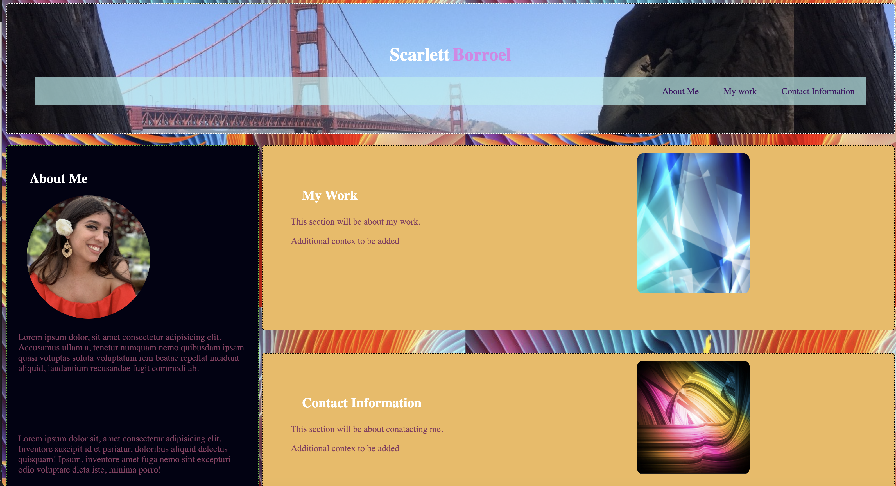

# Portfolio

## Technology Used
HTML
CSS
Git Hub

## Description 

The motivation behind this project was to have a portfolio to show case all of my work and knowledge. Within this project I have created links that will take the viewer to different pages of work that I have created. Creating this portfolio project has made it easier to combine all of my previous and furture work into a space that future employeers can easily navigate through. Throughout the process I learned how much detail goes into creating a personal portfolio and also allows one to showcase many skills within one website.

Lastly, if your project is deployed, include a link to the deployed application here.

## Usage 

Creating my portfolio website makes it easier to display all of my work in one place.

## Learning points
In this project I found that I came into several run-in's with flex-box layout 

## License

N/A

## Credits
N/A

